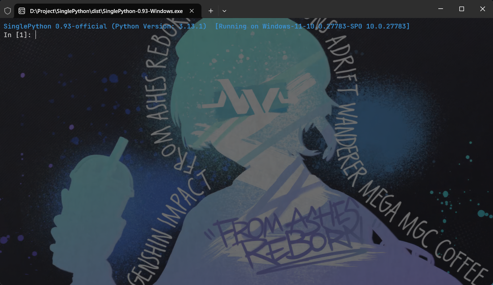

<!--suppress ALL -->

<div align=center></div>
<h1 align="center" name="binpython">SinglePython</h1>
<p align="center">
    <em>SinglePython 是一个轻量级的 Python 解释器，提供交互式命令行和文件执行功能。通过使用 SinglePython，您可以快速运行 Python 脚本、测试代码段或进行交互式开发。
</em>
</p>
<p align="center">


### BiliBili: https://space.bilibili.com/669743441

## 程序截图

<div align=center></div>

## 安装与使用

请按照以下步骤安装并使用 SinglePython：

1. 下载 SinglePython：请在 [SinglePython releases 页面](https://github.com/Han-Xiangming/SinglePython/releases)
   下载适合您操作系统的版本，并解压缩到任意目录。
2. 运行 SinglePython：在命令行中输入 SinglePython.exe（Windows），然后按下回车键。/ 双击 SinglePython.exe（Windows）即可运行。

## 程序说明

该脚本提供了以下功能：

- 交互式 Python 解释器，可以进行实时的 Python 编程；
- 文件执行：使用 -f 或 --file 选项后跟文件名，可以执行指定的 Python 文件。例如：SinglePython -f test.py；
- 显示帮助信息：使用 -h 或 --help 选项可以显示帮助信息，了解其他可用的选项和用法。；
- 显示版本信息：使用 -v 或 --version 选项可以显示 SinglePython 的版本信息。；
- 支持执行系统命令： 在输入时带有 ! 前缀，可以执行系统命令。例如：!dir。
- 支持显示变量信息： 在输入时带有 ? 后缀，可以显示变量信息。例如：a?
- 集成第三方库。

## 构建

### 前提条件

- Python 3.12+
- PyInstaller 4.5+

### 步骤

1. 克隆此项目

```bash
git clone https://github.com/Han-Xiangming/SinglePython
cd SinglePython
```

2. 安装依赖

```bash
pip install -r .\requirement.txt
```

3. 构建 SinglePython

 ```bash
 pyinstaller  -y main.spec
 ```

## 程序贡献者

SinglePython 项目由多位贡献者共同打造，包括：

- Han-Xiangming：项目创建者和维护者。
- 更多贡献者：请参阅 [contributors](https://github.com/Han-Xiangming/SinglePython/graphs/contributors) 页面。

## 致谢

感谢以下项目，它们为 SinglePython 项目提供了灵感和帮助：

- [PyInstaller](https://www.pyinstaller.org/)：用于将 Python 脚本打包成可执行文件。

## 程序许可证

该脚本使用 [Apache License 2.0 许可证](https://github.com/Han-Xiangming/SinglePython/blob/main/LICENSE) 进行授权。

## 联系我们

如果您在使用 SinglePython 过程中遇到任何问题或有任何建议，请通过以下方式与我们联系：

- 发送电子邮件到 2728513634@qq.com。
- 在 [GitHub](https://github.com/Han-Xiangming/SinglePython/issues) 上提交一个 issue。 
